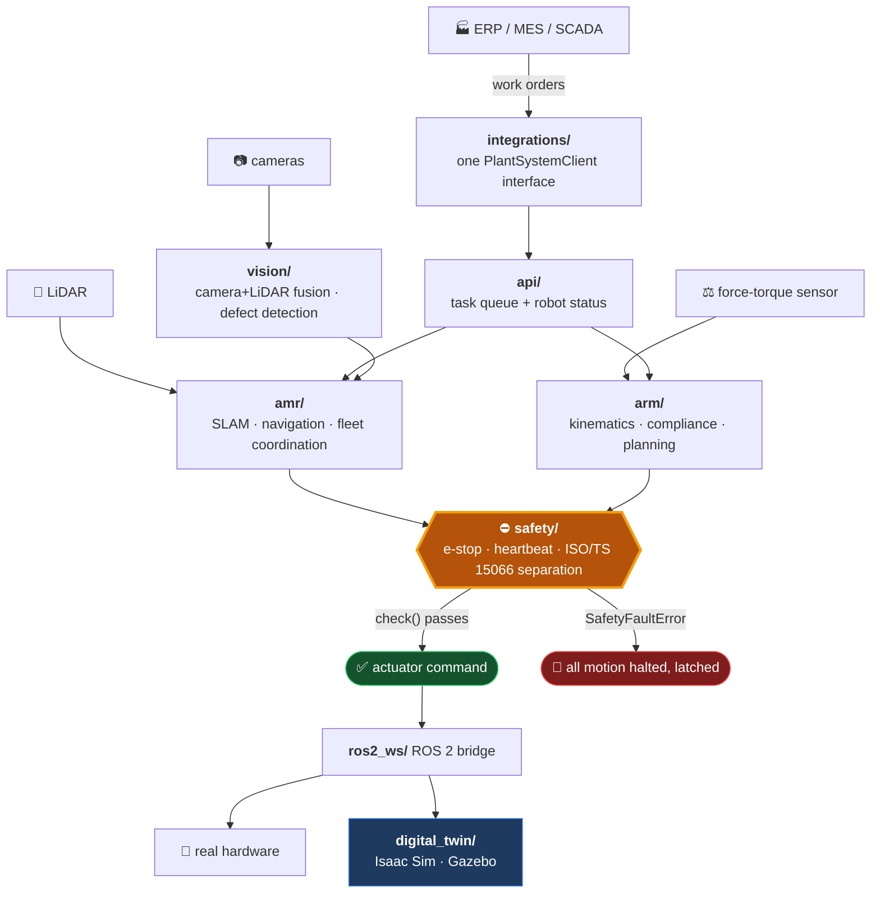

<div align="center">

# 🦾 Advanced Robotics

**AMR fleets, collaborative arms, and AI inspection — where every actuator command passes a safety gate first.**

[](https://github.com/MustafaRajihAli/advanced-robotics/actions/workflows/ci.yml)
[](./tests)
[](https://www.python.org/)
[](https://docs.ros.org/)
[](./src/advanced_robotics/safety/ssm.py)
[](https://github.com/astral-sh/ruff)

[Architecture](./docs/ARCHITECTURE.md) · [Work Plan](./WORK_PLAN.md) · [Service page](https://novusaidynamics.com/services/advanced-robotics.html)

</div>

---

## What this is

Control software for four robotics subsystems on one platform: **autonomous mobile robot fleets**, **collaborative robot arms**, **AI vision inspection**, and the **plant integration layer** that connects them to ERP / MES / SCADA.

Two architectural properties shape everything else:

> [!IMPORTANT]
> **Safety is not optional and not advisory.** Every actuator-facing loop calls `SafetyMonitor.check()` before issuing a command. A `SafetyFaultError` means stop — and the monitor *latches*, so motion stays blocked until an explicit operator reset, even after the triggering condition clears.

> [!TIP]
> **ROS 2 stays at the edge.** Only `ros2_ws/` imports `rclpy`. Everything under `src/advanced_robotics/` is plain Python, so the entire control stack unit-tests in under a second with no ROS 2 installation, no simulator, and no hardware.

---

## How it fits together



The same interfaces drive the simulator and the real robot — so code validated in the digital twin needs no changes to run on hardware.

---

## Subsystems

| Module | What it does | Why it's built this way |
|---|---|---|
| 🚗 **amr** | SLAM, navigation, multi-robot fleet coordination | Obstacle speed scales **proportionally** inside the inflation radius rather than a binary stop — a hard threshold causes the [freezing robot problem](https://docs.nav2.org/), where the planner sees every path blocked and never recovers. A stuck counter triggers rotate-in-place recovery |
| 🦾 **arm** | Kinematics, force-torque compliance, trajectory planning | IK uses **joint-limit clamping + randomized restarts** — a single Newton solve gets trapped in local minima at joint limits. This is TRAC-IK's core insight in numerical form |
| 👁️ **vision** | Multi-camera + LiDAR fusion, defect detection | YOLO-style multi-box output with NMS, not a single confidence score — real inspection scenes contain zero, one, or several distinct defects, each needing its own box |
| 🛑 **safety** | E-stop, heartbeat watchdog, separation monitoring | Implements the **ISO/TS 15066 protective separation distance** formula (now folded into ISO 10218-2:2025). Faults *latch* — silence is never consent to resume |
| 🔌 **integrations** | ERP / MES / SCADA clients | All three implement one `PlantSystemClient` protocol, so the task loop doesn't care which system issued the work |
| 🌐 **digital_twin** | Isaac Sim + Gazebo backends | Train in Isaac Sim → validate in Gazebo → deploy via ROS 2, matching current sim-to-real practice |

---

## Quick start

```bash
git clone https://github.com/MustafaRajihAli/advanced-robotics.git && cd advanced-robotics
pip install -e . -r requirements.txt
pytest
```

29 tests, ~1 second, no ROS 2 or simulator required.

---

## The safety gate in practice

ISO/TS 15066 defines the minimum distance a human may come to a moving robot before a safety-rated stop is required. It scales with robot speed — faster motion demands more separation:

```python
from advanced_robotics.safety.estop import SoftwareEstop
from advanced_robotics.safety.safety_monitor import SafetyMonitor
from advanced_robotics.safety.ssm import protective_separation_distance_m

estop = SoftwareEstop()
monitor = SafetyMonitor(estop=estop, heartbeat_timeout_ms=250)

# How close may an operator get while the arm moves at 0.5 m/s toward them?
print(f"{protective_separation_distance_m(0.5):.2f} m")   # -> 1.50 m

monitor.check_separation(measured_distance_m=3.0, robot_speed_toward_human_mps=0.5)   # fine

# Operator steps inside the protective distance -> SafetyFaultError, and the monitor latches
monitor.check_separation(measured_distance_m=0.4, robot_speed_toward_human_mps=0.5)

monitor.check()   # still raises — the fault is latched even after they back away
monitor.reset()   # requires an explicit, audited reset
monitor.check()   # clear
```

That latching behavior is deliberate: a robot that silently resumes motion the instant a sensor reading improves is exactly the failure mode safety standards exist to prevent.

<details>
<summary><b>Why proportional slowdown instead of a stop threshold</b></summary>

<br/>

A binary "stop if an obstacle is within X metres" rule produces the **freezing robot problem** — in a busy warehouse the planner concludes every path is blocked and the robot simply stops forever.

The navigator instead follows Nav2's costmap inflation model: speed scales smoothly from full to zero between the inflation radius and the hard safety margin, and a stuck counter triggers rotate-in-place recovery rather than an indefinite wait.

```python
nav = Navigator(
    slam=slam,
    max_linear_speed_mps=1.0,
    max_angular_speed_radps=0.8,
    obstacle_safety_margin_m=0.2,   # hard stop inside this
    inflation_radius_m=1.0,         # begin slowing here
    stuck_threshold=20,             # then recover, don't freeze
)

linear, angular = nav.compute_velocity_command(goal, obstacles)
nav.is_stuck()   # True -> rotate in place to re-scan
```

Config defaults mirror Nav2's recommended indoor-warehouse tuning (`robot_radius ≈ 0.35 m`, `inflation_radius = 0.55 m`, `cost_scaling_factor = 3.0`).

</details>

<details>
<summary><b>Why IK needs randomized restarts</b></summary>

<br/>

A plain damped-least-squares Newton solve converges to whatever local minimum it starts nearest — and near joint limits, that's frequently no solution at all, even when a valid one exists.

TRAC-IK's answer is to run two solvers concurrently and detect local-minima traps. This implementation approximates that numerically: clamp to joint limits every iteration, and on failure retry from randomized configurations sampled *within* those limits.

```python
arm = ArmKinematics(dh_params, joint_limits=[JointLimit(-2.9, 2.9)] * 6)

solved = arm.inverse(
    target_pose,
    initial_guess_rad=[0.0] * 6,
    max_restarts=8,          # escape local minima
)
```

A test asserts recovery from a deliberately poor initial guess that a single-start solver fails on. For production, swap in `pick_ik` or a MoveIt 2 plugin where microsecond solve times matter.

</details>

<details>
<summary><b>Hardware / simulator parity</b></summary>

<br/>

`digital_twin/simulator.py` defines `SimulatorBackend` — the same interface shape the real ROS 2 drivers expose. AMR, arm, and vision logic is written against that interface, never against ROS 2 or a specific engine directly.

| Backend | Role |
|---|---|
| `IsaacSimBackend` | GPU-parallel RL policy training, high visual/physical fidelity |
| `GazeboBackend` | ROS 2-native validation on the same topics the real robot uses |
| `NullSimulator` | No-op, so twin-dependent code imports and tests cleanly |

The result: a policy trained in Isaac Sim is validated in Gazebo over `/odom` and `/cmd_vel`, then runs on hardware through `ros2_ws/src/novus_robotics_bridge` — with no changes to the control code.

</details>

<details>
<summary><b>Project layout</b></summary>

<br/>

```
src/advanced_robotics/
├── core/           config schema, shared types, errors
├── amr/            SLAM interface, navigation, fleet coordination
├── arm/            kinematics + IK, force-torque compliance, motion planning
├── vision/         camera/LiDAR fusion, defect detection
├── safety/         e-stop, safety monitor, ISO/TS 15066 separation
├── integrations/   ERP / MES / SCADA clients behind one protocol
├── digital_twin/   Isaac Sim, Gazebo, and null backends
└── api/            internal API for plant systems

ros2_ws/            ROS 2 workspace — the only place rclpy is imported
simulation/         digital twin worlds and assets
config/             runtime configuration
docs/               ARCHITECTURE.md
tests/              29 tests
```

</details>

---

## Status

> [!WARNING]
> **Phase 0–1 scaffold — not deployment-ready.** The safety logic, kinematics, and fleet allocation are real and tested, but SLAM/Nav2 wiring, trained inspection models, and the simulator backends are interfaces awaiting integration. No safety claim here substitutes for a formal risk assessment and certified safety-rated hardware.

| Phase | Scope | State |
|:--|:--|:--|
| **0** | Repo foundations, shared types, ROS 2 bridge skeleton | ✅ Complete |
| **1** | AMR navigation — proportional avoidance, recovery, fleet allocation | ✅ Logic complete, Nav2 wiring pending |
| **2** | Arm control — kinematics, IK restarts, force limits | ✅ Logic complete, hardware pending |
| **3** | Vision inspection — fusion + NMS pipeline | ⬜ Needs trained model |
| **4** | Safety layer — e-stop, watchdog, ISO/TS 15066 | ✅ Complete |
| **5** | Plant integration — ERP / MES / SCADA end to end | ⬜ Endpoint schemas unconfirmed |
| **6** | Digital twin + sim-to-real RL | ⬜ Backends stubbed |

**What's real today:** ISO/TS 15066 separation math and the latching safety monitor, Nav2-style proportional avoidance with freezing-robot recovery, DH-parameter forward kinematics and multi-restart IK with joint limits, force-torque limit enforcement, greedy fleet allocation, camera/LiDAR time sync, and YOLO-style NMS.

**What's an interface:** SLAM/Nav2 backends, the trained defect model, Isaac Sim and Gazebo adapters, and the ERP/MES/SCADA endpoint schemas — the REST shapes in `integrations/` are placeholders to confirm against the real systems.

> [!NOTE]
> The service page's figures — *5x throughput, sub-millimetre accuracy, 60% cost reduction, 99.8% uptime* — are targets to validate against real hardware, not properties of this repository.

**Deliberately out of scope for now:** surgical robotics and hazardous-environment (nuclear, EOD) applications. Those need certified hardware and domain-specific safety cases well beyond a control-software scaffold — revisit once Phases 0–4 are proven on real equipment.

---

## Documentation

| Document | Contents |
|---|---|
| [**ARCHITECTURE.md**](./docs/ARCHITECTURE.md) | Data flow, design principles, real vs. stubbed inventory |
| [**WORK_PLAN.md**](./WORK_PLAN.md) | Website-claim → engineering-scope mapping, phased plan, research sources |

---

<div align="center">
<sub>Built by <a href="https://novusaidynamics.com">Novus AI Dynamics</a></sub>
</div>
